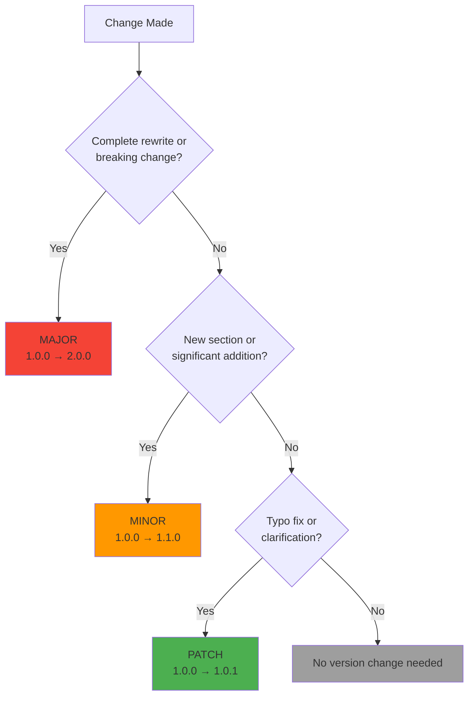
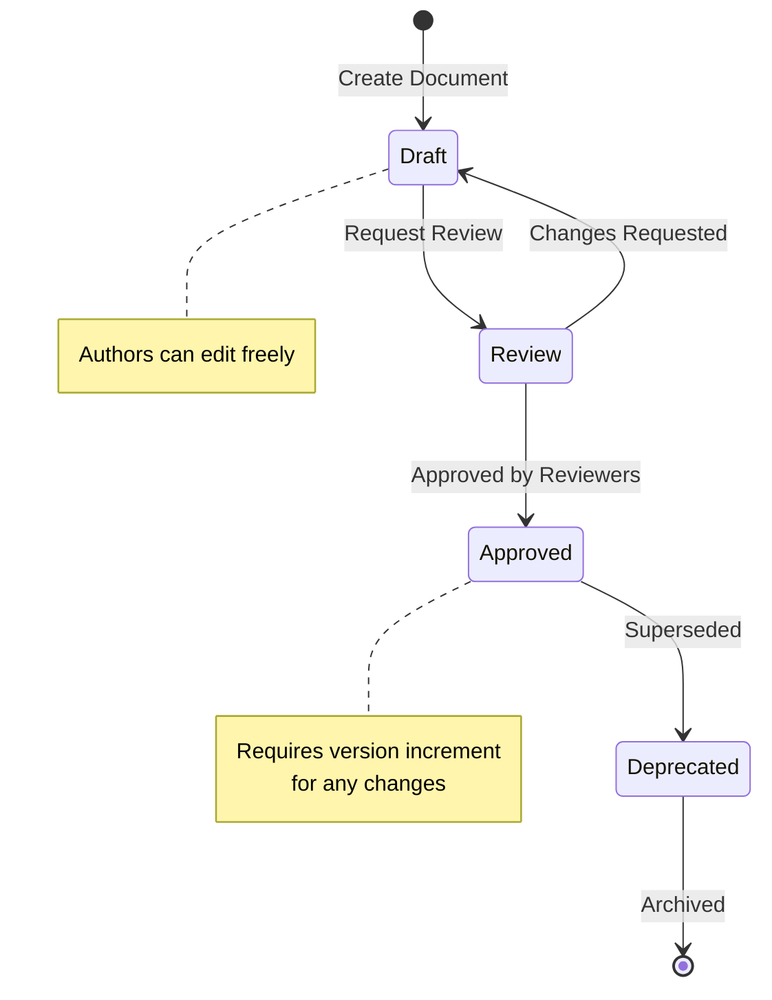

# Documentation Versioning & Version Control

**Version**: 1.0.0  
**Last Updated**: January 10, 2026  
**Status**: Approved

---

## 📋 Overview

This document provides a comprehensive guide to the documentation versioning and version control system implemented for the AgenticOmni project. It combines both practical quick-reference guidelines and implementation details to ensure all documentation is properly versioned, tracked, and maintained with industry-standard practices.

---

## 🚀 Quick Start

### For New Documents

```bash
# 1. Copy template
cp docs/templates/DOCUMENT_TEMPLATE.md docs/my-new-doc.md

# 2. Fill in header information (YAML frontmatter)
# Edit the version header at the top

# 3. Write content

# 4. Validate before committing
python scripts/validate_docs.py

# 5. Add to version control
git add docs/my-new-doc.md
git commit -m "docs: feat(scope): add my-new-doc v1.0.0"
```

### For Updating Existing Documents

```bash
# 1. Determine version increment type
# - PATCH (x.x.1): Typos, clarifications, minor fixes
# - MINOR (x.1.0): New sections, diagrams, features
# - MAJOR (2.0.0): Complete rewrites, breaking changes

# 2. Update version in YAML frontmatter

# 3. Add entry to CHANGELOG.md

# 4. Update "Last Updated" date at bottom

# 5. Validate changes
python scripts/validate_docs.py

# 6. Commit with descriptive message
git commit -m "docs: update(scope): description v1.1.0"
```

---

## 📊 Semantic Versioning (SemVer 2.0.0)

### Version Format

```
MAJOR.MINOR.PATCH

Examples:
1.0.0 → 2.0.0  (MAJOR: Breaking changes, complete rewrites)
1.0.0 → 1.1.0  (MINOR: New sections, significant additions)
1.0.0 → 1.0.1  (PATCH: Fixes, typos, clarifications)
```

### Version Increment Decision Tree



### Version Increment Examples

| Change Type | Example | Version Change |
|-------------|---------|----------------|
| **Typo fix** | Fix spelling errors | 1.0.0 → 1.0.1 |
| **Clarification** | Add missing code example | 1.0.0 → 1.0.1 |
| **New section** | Add "Troubleshooting" section | 1.0.0 → 1.1.0 |
| **New diagram** | Add architecture diagram | 1.0.0 → 1.1.0 |
| **Complete rewrite** | Restructure entire document | 1.0.0 → 2.0.0 |
| **Breaking change** | Change API structure | 1.0.0 → 2.0.0 |

---

## 📝 Common Scenarios

### Scenario 1: Fix a Typo

```yaml
# OLD YAML frontmatter
version: "1.2.3"
```

```yaml
# NEW YAML frontmatter
version: "1.2.4"
```

```markdown
# Add to CHANGELOG.md
## [1.2.4] - 2026-01-10

### Fixed
- Fixed typo in configuration example (line 45)
- Corrected command in setup script
```

---

### Scenario 2: Add New Section

```yaml
# OLD
version: "1.2.3"
```

```yaml
# NEW
version: "1.3.0"
```

```markdown
# Add to CHANGELOG.md
## [1.3.0] - 2026-01-10

### Added
- New "Troubleshooting" section with common issues and solutions
- Added 3 new Mermaid diagrams for error handling flows
- Environment variable reference table
```

---

### Scenario 3: Complete Rewrite

```yaml
# OLD
version: "1.2.3"
```

```yaml
# NEW
version: "2.0.0"
```

```markdown
# Add to CHANGELOG.md
## [2.0.0] - 2026-01-15

### Changed
- Complete restructure of document architecture (BREAKING)
- Updated API examples to use new authentication system (BREAKING)
- Migrated from REST to GraphQL examples (BREAKING)

### Removed
- Deprecated authentication methods (removed from v1.x)
```

---

## 🎯 YAML Frontmatter Reference

### Required Fields

```yaml
---
title: "Full Document Title"           # Document title
version: "1.0.0"                        # Semantic version (X.Y.Z)
date: "2026-01-09"                      # ISO 8601 date (YYYY-MM-DD)
authors: ["Name 1", "Name 2"]           # List of authors
reviewers: []                           # List of reviewers
status: "draft"                         # draft | review | approved | deprecated
changelog: "./CHANGELOG.md#version"     # Link to changelog entry
---
```

### Optional Fields

```yaml
tags: ["architecture", "api"]           # Searchable tags
related: ["./other-doc.md"]             # Related documents
type: "guide"                           # Document type (guide, spec, reference)
supersedes: "old-doc-v1.md"            # Deprecated document this replaces
---
```

---

## 📋 Document Status Lifecycle

### Status Flow



### Status Definitions

| Status | Description | Who Can Edit | Next States |
|--------|-------------|--------------|-------------|
| **draft** | Work in progress, not reviewed | Authors | review |
| **review** | Ready for peer review | Authors + Reviewers | draft, approved |
| **approved** | Reviewed and production-ready | Restricted (requires new version) | deprecated |
| **deprecated** | Outdated, replaced by newer version | Read-only | - |

---

## 📝 CHANGELOG Entry Format

### Standard Entry Template

```markdown
## [X.Y.Z] - YYYY-MM-DD

### Added
- New feature or section
- Another addition

### Changed
- Modified section or behavior
- Updated diagram

### Fixed
- Bug fix or correction
- Typo fix

### Deprecated
- Feature marked for removal
- Old section still present but discouraged

### Removed
- Deleted content
- Removed section

### Security
- Security-related change
```

### Real Example

```markdown
## [1.2.0] - 2026-01-15

### Added
- Added "Docker Troubleshooting" section with 10 common issues
- New sequence diagram for authentication flow
- Added environment variable reference table

### Changed
- Updated PostgreSQL version from 15 to 16 throughout document
- Improved code examples with better error handling
- Restructured "Configuration" section for better clarity

### Fixed
- Corrected broken link to API specification (line 234)
- Fixed incorrect command in setup script example
- Typo: "databse" → "database" (3 occurrences)

### Deprecated
- Old authentication method (will be removed in v2.0.0)
```

---

## ✅ Pre-Commit Checklist

Before committing documentation changes, ensure:

- [ ] **Version number** incremented in YAML frontmatter
- [ ] **Date** updated in YAML frontmatter
- [ ] **"Last Updated"** date at bottom of document updated
- [ ] **CHANGELOG.md** entry added with version and changes
- [ ] **Status** updated if moving from draft → review → approved
- [ ] **All internal links** verified (run validation script)
- [ ] **Code examples** tested and working
- [ ] **Mermaid diagrams** render correctly
- [ ] **Validation script** passed: `python scripts/validate_docs.py`
- [ ] **No linting errors**
- [ ] **Git commit message** follows conventional format

---

## 🔍 Validation Script Usage

### Running Validation

```bash
# Validate all documentation
python scripts/validate_docs.py

# Expected output if passing:
✅ All documentation is valid!
  - docs/IMPLEMENTATION.md v0.2.0
  - docs/ENV_CONFIGURATION.md v1.0.0
  - docs/VERSIONING.md v1.0.0
  ...
```

### What It Checks

1. ✅ YAML frontmatter present and valid
2. ✅ Required fields (title, version, date, authors, status)
3. ✅ Version format (X.Y.Z semantic versioning)
4. ✅ Date format (YYYY-MM-DD)
5. ✅ Valid status value (draft/review/approved/deprecated)
6. ✅ No broken internal links
7. ✅ "Last Updated" timestamp present

### Common Validation Errors

#### Missing Version Header

```
❌ docs/my-doc.md: Missing YAML frontmatter (should start with '---')
```

**Fix**: Add version header at top of file

---

#### Invalid Version Format

```
❌ docs/my-doc.md: Invalid version format: 1.0 (expected X.Y.Z)
```

**Fix**: Use three-part version: `1.0.0`

---

#### Broken Link

```
❌ docs/my-doc.md: Broken link: [API Spec](../specs/nonexistent.yaml)
```

**Fix**: Verify file path or update link

---

## 🔄 Git Workflow

### Commit Message Format

```
docs: <type>(<scope>): <subject>

<body>

<footer>
```

### Commit Types

- **feat**: New documentation
- **fix**: Documentation corrections
- **update**: Content updates
- **refactor**: Restructuring
- **style**: Formatting only
- **chore**: Maintenance

### Commit Examples

```bash
# Good commit messages
git commit -m "docs: feat(api): add authentication guide v1.0.0"
git commit -m "docs: fix(setup): correct Docker command typo v1.2.1"
git commit -m "docs: update(arch): add new microservices diagram v1.3.0"
git commit -m "docs: refactor(structure): reorganize sections v2.0.0"

# Bad commit messages
git commit -m "update docs"
git commit -m "fix"
git commit -m "added stuff"
```

### Branch Strategy

```bash
# Create feature branch for documentation changes
git checkout -b docs/update-implementation-summary

# Make changes, increment version, update CHANGELOG

# Commit with semantic message
git commit -m "docs: update(impl): add Phase 3 details v1.1.0"

# Push and create pull request
git push origin docs/update-implementation-summary
```

---

## 📊 Version History Table

Include this table at the end of your versioned document:

```markdown
## 📝 Version History

| Version | Date | Changes | Author |
|---------|------|---------|--------|
| 1.0.0 | 2026-01-09 | Initial release | John Doe |
| 1.0.1 | 2026-01-10 | Fixed typos in section 3 | Jane Smith |
| 1.1.0 | 2026-01-15 | Added troubleshooting section | John Doe |
| 2.0.0 | 2026-02-01 | Complete rewrite with new architecture | Dev Team |
```

---

## 🎓 Best Practices

### DO ✅

- **Update version** on every meaningful change
- **Write clear CHANGELOG entries** with specific details
- **Test all code examples** before committing
- **Verify links** before committing (run validation script)
- **Run validation script** before push
- **Use semantic versioning** consistently
- **Keep CHANGELOG** up-to-date with every version
- **Update "Last Updated"** date at document end
- **Use descriptive commit messages**
- **Review changes** before marking as approved

### DON'T ❌

- Skip version increments for "small" changes
- Forget to update CHANGELOG
- Leave broken links in documentation
- Use non-standard version formats (v1.0, 1.0, 1.x)
- Change approved docs without incrementing version
- Commit without running validation
- Mix multiple unrelated changes in one version bump
- Use vague commit messages
- Bypass peer review for important docs

---

## 🛠️ Documentation Infrastructure

### Core Components

| Component | File | Purpose | Status |
|-----------|------|---------|--------|
| **Documentation Index** | `docs/README.md` | Central catalog and navigation | ✅ Complete |
| **Change Log** | `docs/CHANGELOG.md` | Complete change history | ✅ Complete |
| **Versioning Guide** | `docs/VERSIONING.md` | This document | ✅ Complete |
| **Implementation** | `docs/IMPLEMENTATION.md` | Implementation status | ✅ Complete |

### Document Templates

| Template | File | Purpose | Status |
|----------|------|---------|--------|
| **General Document** | `docs/templates/DOCUMENT_TEMPLATE.md` | Standard documentation template | ✅ Complete |
| **ADR Template** | `docs/templates/ADR_TEMPLATE.md` | Architecture Decision Records | ✅ Complete |

Both templates include:
- ✅ YAML frontmatter with version metadata
- ✅ Version history table
- ✅ Maintenance notes
- ✅ Mermaid diagram examples
- ✅ Standard sections and formatting

### Validation & Automation

| Tool | File | Purpose | Status |
|------|------|---------|--------|
| **Validation Script** | `scripts/validate_docs.py` | Automated doc validation | ✅ Complete |
| **Structure Validator** | `scripts/validate_structure.py` | Project structure check | ✅ Complete |

**Validation Script Features**:
- ✅ YAML frontmatter validation
- ✅ Semantic version format checking (X.Y.Z)
- ✅ Date format validation (YYYY-MM-DD)
- ✅ Status field validation
- ✅ Broken link detection
- ✅ "Last Updated" timestamp check
- ✅ Colored terminal output
- ✅ Detailed error reporting

---

## 🔗 Related Resources

### Internal Documentation
- [Documentation Index](./README.md) - Complete documentation catalog
- [CHANGELOG](./CHANGELOG.md) - Documentation change history
- [Implementation Status](./IMPLEMENTATION.md) - Current implementation (v0.2.0)
- [Document Template](./templates/DOCUMENT_TEMPLATE.md) - Standard template
- [ADR Template](./templates/ADR_TEMPLATE.md) - Architecture Decision Record template

### External Standards
- [Semantic Versioning 2.0.0](https://semver.org/) - SemVer specification
- [Keep a Changelog](https://keepachangelog.com/) - CHANGELOG format
- [Conventional Commits](https://www.conventionalcommits.org/) - Commit message format

---

## 📞 Getting Help

### Questions about Versioning?
- Review this guide and examples above
- Check [CHANGELOG.md](./CHANGELOG.md) for real examples
- See [docs/README.md](./README.md) for documentation index
- Ask in team documentation channel

### Found a Bug in Validation Script?
- Report issue in GitHub with `docs` label
- See [scripts/validate_docs.py](../scripts/validate_docs.py) for source
- Include error message and affected file

### Need a New Template?
- Start with [DOCUMENT_TEMPLATE.md](./templates/DOCUMENT_TEMPLATE.md)
- or [ADR_TEMPLATE.md](./templates/ADR_TEMPLATE.md)
- Customize for your specific needs
- Consider contributing it back as a new template

---

## 📊 Implementation Summary

### What Was Implemented

✅ **Versioning System**
- Semantic versioning (SemVer 2.0.0) for all documentation
- YAML frontmatter with version metadata
- Document status lifecycle (draft → review → approved → deprecated)
- Version increment decision tree

✅ **CHANGELOG System**
- Standardized entry format
- Categories: Added, Changed, Fixed, Deprecated, Removed, Security
- Real examples and templates

✅ **Validation & Automation**
- Automated validation script
- Pre-commit checks
- Broken link detection
- Format verification

✅ **Templates & Standards**
- General document template
- ADR (Architecture Decision Record) template
- Version history table
- Mermaid diagram examples

✅ **Git Workflow**
- Conventional commit messages
- Branch strategy
- Peer review process

### Benefits

- ✅ **Consistency** - All docs follow the same format
- ✅ **Traceability** - Every change is tracked with versions
- ✅ **Quality** - Automated validation prevents errors
- ✅ **Discoverability** - Easy to find specific versions
- ✅ **Maintainability** - Clear process for updates
- ✅ **Professionalism** - Industry-standard practices

---

## 📝 Version History

| Version | Date | Changes | Author |
|---------|------|---------|--------|
| 1.0.0 | 2026-01-10 | Initial merged version (VERSIONING_GUIDE + VERSION_CONTROL_SUMMARY) | Development Team |

---

*This document follows [Semantic Versioning](https://semver.org/) and is maintained according to the [Documentation Standards](./README.md).*

**Last Updated**: January 10, 2026  
**Document Status**: Approved  
**For Full Documentation Guidelines**: See [docs/README.md](./README.md)
