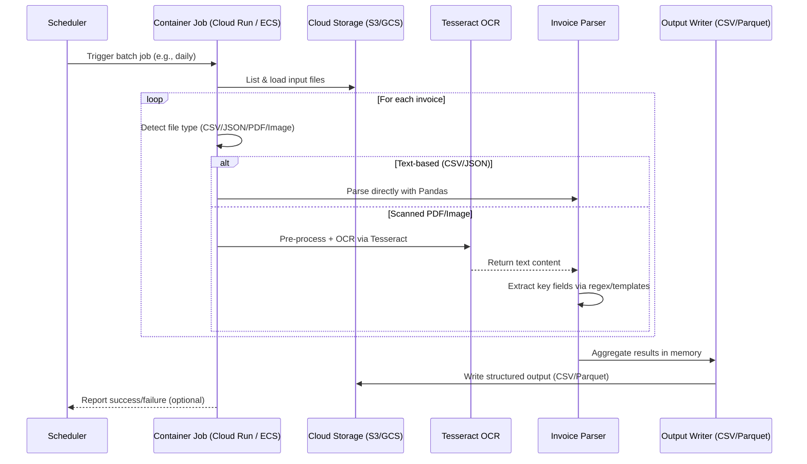
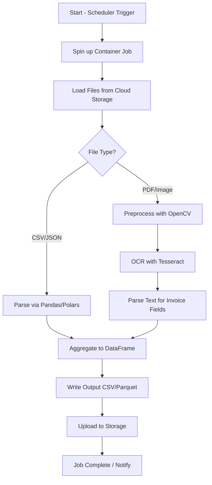

## OmniAI (万象智文Omni Intelligent Documents) – Technical & Business Analysis

### 1. Modern Enterprise AI Stack

**Pipeline:** ETL → RAG → Agent → Human

**Stack:**
- Python
- Next.js
- LangChain
- Supabase
- Vector DB

**Target:**
- Enterprise SaaS
- Upgrade legacy document systems

**Key Industries:**
- Legal, insurance, government, healthcare, engineering, finance

---

### 2. Major Advantages

**Correct architecture direction:**
```
Document ingestion
   ↓
Data normalization
   ↓
Knowledge indexing
   ↓
RAG retrieval
   ↓
Agent reasoning
   ↓
Human verification
```

**Enterprise upgrade positioning:**
Upgrade legacy document/paper systems with AI. Most companies still use SharePoint, file servers, paper documents, PDFs, legacy ECM systems. OmniAI can become the AI layer on top of enterprise documents.

**Good technology stack:**
| Layer    | Tech      | Verdict   |
| -------- | --------- | --------- |
| Frontend | Next.js   | excellent |
| Backend  | Python    | excellent |
| Agent    | LangChain | good      |
| DB       | Supabase  | good      |
| Vector   | vector DB | correct   |

**Agentic architecture:**
Future model: software → AI agents → users. This is the direction major companies are moving toward.

---

### 3. Weaknesses & Recommendations

**No clear differentiation yet:**
Currently similar to RAG platforms, AI knowledge bases, document AI systems (Dify, RagFlow, Glean, LlamaIndex Cloud, OpenAI Enterprise Retrieval). Need unique features.

**Missing enterprise features:**
Security, compliance, audit, permissions, monitoring, cost control. Add centralized AI policy, audit logs, agent permission control, data governance.

**No multi-agent orchestration:**
Modern AI systems are multi-agent. Support agent teams, agent pipelines, agent orchestration.

**No plugin ecosystem:**
Enterprise systems need connectors (SAP, Salesforce, SharePoint, Google Drive, Dropbox, Slack, Notion, Jira, CRM, ERP). Add connectors via standardized protocols (MCP servers).

**Missing AI governance layer:**
Add AI governance, cost control, usage monitoring, model routing (AI Gateway, Agent Gateway, MCP Gateway).

---

### 4. Practical Stack & Implementation Blueprint

**Ingestion + parsing:**
- Docling for high-quality document conversion (PDF/DOCX/PPTX → structured text/markdown/json)
- OCR: PaddleOCR / DeepSeek OCR (wrap behind interface)

**Storage:**
- PostgreSQL as system-of-record (metadata, tenants, permissions, processing status)
- pgvector for embeddings
- Optional: S3/MinIO for originals/artifacts

**Indexing / retrieval:**
- Hybrid: vector + keyword (Postgres full-text search, pgvector)
- Optional: reranker model or LLM-based rerank on top-K

**RAG orchestration:**
- LangChain / LlamaIndex (design a "retrieval contract" layer for flexibility)

**GraphRAG:**
- Use for cross-document relationship reasoning (people/orgs/transactions/contracts)

**LoRA:**
- Phase 2–3: fine-tune smaller models for classification, routing, entity extraction, or domain style

**Evaluation + QA:**
- Build evaluation harness early (retrieval metrics, extraction accuracy, regression tests)

**Deployment:**
- MVP: Docker Compose / single VM
- Mature: Kubernetes + background workers + queue + metrics/logging

---

### 5. Implementation Roadmap & Folder Structure

**Recommended Folders:**
- `/ingestion_parsing`: Docling, OCR interface
- `/storage_indexing`: PostgreSQL, pgvector, metadata, tenants, permissions
- `/rag_orchestration`: LangChain/LlamaIndex workflows, retrieval contract
- `/eval_harness`: Retrieval metrics, extraction accuracy tests
- `/security_auth`: Multi-tenant separation, RBAC
- `/api`: Backend server, natural querying, admin tasks, audit pack exports
- `/frontend`: UI and visualization

**Analogy:**
Tech solution as a Digital Librarian: Docling/Whisper are "eyes and ears"; PostgreSQL/pgvector is the "shelf system"; LangGraph agents are "expert researchers".

---

### 6. Visual Workflows & Diagrams

#### Batch Processing Sequence


#### Batch Processing Flowchart


* legal
* insurance
* government
* healthcare
* engineering
* finance

Huge market.

---

### 3️⃣ Good technology stack

Your stack is **industry standard**.

| Layer    | Your tech | Verdict   |
| -------- | --------- | --------- |
| Frontend | Next.js   | excellent |
| Backend  | Python    | excellent |
| Agent    | LangChain | good      |
| DB       | Supabase  | good      |
| Vector   | vector DB | correct   |

No major problems.

---

### 4️⃣ Agentic architecture

Agentic systems are the **next generation of enterprise software**.

Instead of:

```
software → user
```

Future model:

```
software → AI agents → users
```

This is exactly the direction major companies are moving toward.

---

# 2. Weaknesses (Where AgenticOmni Is Currently Weak)

These are **very important** if you want this to become a serious product.

---

# Weakness 1 — No clear differentiation yet

Right now your system sounds similar to:

* RAG platforms
* AI knowledge bases
* document AI systems

Examples:

* Dify
* RagFlow
* Glean
* LlamaIndex Cloud
* OpenAI Enterprise Retrieval

Without differentiation, it becomes **another RAG app**.

---

# Weakness 2 — Missing enterprise features

Enterprise buyers care about:

```
Security
Compliance
Audit
Permissions
Monitoring
Cost control
```

Example:

Enterprise AI platforms now include:

* centralized AI policy
* audit logs
* agent permission control
* data governance

For example, enterprise agent platforms provide **audit logs, permission boundaries, and centralized policy control** to ensure safe deployment of AI agents. ([WorkingAgents][1])

Your system must include these.

---

# Weakness 3 — No multi-agent orchestration

Modern AI systems are **multi-agent systems**.

Example:

```
Document Agent
Extraction Agent
Compliance Agent
Summary Agent
Decision Agent
```

Research shows multi-agent platforms enable complex workflows and coordination between agents to complete tasks more reliably. ([arXiv][2])

AgenticOmni should support:

```
agent teams
agent pipelines
agent orchestration
```

---

# Weakness 4 — No plugin ecosystem

Enterprise systems need connectors.

Example:

```
SAP
Salesforce
SharePoint
Google Drive
Dropbox
Slack
Notion
Jira
CRM
ERP
```

Modern agent platforms connect to **dozens or hundreds of tools via standardized protocols such as MCP servers.** ([Gist][3])

Without connectors, adoption is difficult.

---

# Weakness 5 — Missing AI governance layer

Large enterprises need:

```
AI governance
cost control
usage monitoring
model routing
```

Example architecture:

```
AI Gateway
Agent Gateway
MCP Gateway
```

These control model access, tools, and permissions centrally. ([WorkingAgents][1])

---

# 3. Major Competitors / Similar Platforms

Here are the **most relevant projects**.

---

# Tier 1 — Direct competitors

## Dify

What it does:

```
Enterprise LLM application platform
```

Features:

* visual workflow
* RAG
* agent tools
* API publishing
* dataset management

Very popular.

---

## RagFlow

Focus:

```
Document RAG platform
```

Key features:

* advanced document parsing
* GraphRAG
* knowledge management

---

## FastGPT

Focus:

```
enterprise AI knowledge base
```

Strong in China.

---

## Wanwu Agent Platform

An enterprise AI agent platform with:

* model management
* RAG
* workflow orchestration
* multi-tenant system
* knowledge base management
* enterprise integration. ([GitHub][4])

This platform is **very close to what AgenticOmni could become**.

---

# Tier 2 — Enterprise AI knowledge platforms

Very strong competitors.

### Glean

Enterprise knowledge AI.

Used by:

* Cisco
* Reddit
* Databricks

---

### Microsoft Copilot Enterprise

Deep integration:

* Office
* SharePoint
* Teams

---

### OpenAI Enterprise Retrieval

Now built into ChatGPT Enterprise.

---

# 4. Feature Ideas to Import into AgenticOmni

Here are **modern features you should add**.

---

# Feature Set 1 — Multi-agent orchestration

Architecture:

```
Orchestrator
 ├ Research Agent
 ├ Extraction Agent
 ├ Compliance Agent
 ├ Analysis Agent
 └ Summary Agent
```

Benefits:

* better reliability
* parallel processing
* complex reasoning

---

# Feature Set 2 — Visual workflow builder

Like:

* n8n
* Dify
* Zapier

Example UI:

```
Document
   ↓
OCR
   ↓
Classification
   ↓
Extraction
   ↓
RAG
   ↓
Agent analysis
```

This makes enterprise adoption **10× easier**.

---

# Feature Set 3 — Document intelligence

Add:

```
OCR
table extraction
image understanding
chart extraction
metadata extraction
```

This is critical for:

* contracts
* invoices
* forms
* scanned docs

---

# Feature Set 4 — Enterprise connectors

Build connectors:

```
SharePoint
Google Drive
Dropbox
Confluence
Jira
Slack
Salesforce
SAP
Notion
email
```

These are mandatory for enterprise adoption.

---

# Feature Set 5 — Knowledge Graph RAG

Next generation RAG:

```
Vector RAG
+ Graph RAG
+ Hybrid search
```

This improves:

* accuracy
* relationship reasoning

---

# Feature Set 6 — AI governance layer

Dashboard:

```
AI usage
cost
model selection
agent logs
security alerts
```

---

# Feature Set 7 — Agent marketplace

Allow users to publish:

```
document agents
compliance agents
legal agents
finance agents
```

Example:

```
Agent Marketplace
```

---

# Feature Set 8 — Multi-model routing

Example:

```
simple tasks → cheap model
complex tasks → GPT-4 / Claude
```

This reduces cost.

---

# Feature Set 9 — Human-in-the-loop workflows

Very important for enterprise.

Example:

```
AI extracts contract
↓
human review
↓
AI updates system
```

---

# 5. Strategic Advantages by Region

---

# 🇨🇦 🇺🇸 North America advantages

Focus:

### 1️⃣ Compliance

Add:

```
SOC2
HIPAA
GDPR
FedRAMP
```

---

### 2️⃣ Vertical solutions

Example:

```
Legal document AI
Insurance document AI
Healthcare document AI
Construction document AI
```

---

### 3️⃣ Integration

Companies want:

```
AI layer on existing systems
```

Your positioning is perfect.

---

# 🇨🇳 China advantages

China AI ecosystem focuses on:

```
private deployment
data control
local models
```

Important features:

* private LLM deployment
* Chinese OCR
* Chinese knowledge extraction
* Chinese regulations

Platforms like Wanwu already support local model hosting and enterprise deployment. ([GitHub][4])

---

# 6. My Honest Evaluation

Current concept:

```
7 / 10
```

Good idea but **not yet differentiated**.

If you add:

```
multi-agent orchestration
visual workflow
enterprise governance
document intelligence
connectors
agent marketplace
```

Then it becomes:

```
9 / 10
startup-level product
```

---

# 7. My Recommended Architecture (Next Version)

Future **AgenticOmni architecture**

```
AgenticOmni

UI
 ├ Dashboard
 ├ Workflow builder
 ├ Knowledge base
 ├ Agent marketplace

Core Platform
 ├ Agent orchestrator
 ├ Workflow engine
 ├ RAG engine
 ├ Knowledge graph
 ├ Model router

Data Layer
 ├ Vector DB
 ├ Graph DB
 ├ Document store

Enterprise Layer
 ├ Permissions
 ├ Audit logs
 ├ Cost monitoring
 ├ API gateway

Integration Layer
 ├ MCP tools
 ├ SaaS connectors
 ├ enterprise APIs
```

---

# 8. My Most Important Advice

Your product should **NOT be just another RAG platform.**

Instead position it as:

### **Enterprise AI Document Operating System**

or

### **Autonomous Document Intelligence Platform**

---

# If you want, I can also show you:

1️⃣ **20 killer features that could make AgenticOmni a top AI project on GitHub**
2️⃣ **Startup roadmap to turn AgenticOmni into a $50M SaaS product**
3️⃣ **A redesigned architecture better than Dify / LangChain apps**
4️⃣ **The exact features investors expect in 2026 AI startups**

These will help your project **stand out globally**.

[1]: https://workingagents.ai/?utm_source=chatgpt.com "WorkingAgents — AI Infrastructure for the Agent Era"
[2]: https://arxiv.org/abs/2402.14034?utm_source=chatgpt.com "AgentScope: A Flexible yet Robust Multi-Agent Platform"
[3]: https://gist.github.com/ruvnet/2e08d3ac9bf936fd867978aaa4f0d3c6?utm_source=chatgpt.com "Agentic Coding MCPs: Build agent workflows with more than 80 MCP servers using Composio. Instantly connect to databases, AI tools, project management, social apps, CRMs, storage, finance, and dev platforms. Simple URLs, secure access, modular control. Power up your agents with real-world actions across cloud and enterprise systems — all in seconds. · GitHub"
[4]: https://github.com/UnicomAI/wanwu?utm_source=chatgpt.com "GitHub - UnicomAI/wanwu: China Unicom's Yuanjing Wanwu Agent Platform is an enterprise-grade, multi-tenant AI agent development platform. It helps users build applications such as intelligent agents, workflows, and rag, and also supports model management. The platform features a developer-friendly license, and we welcome all developers to build upon the platform."
