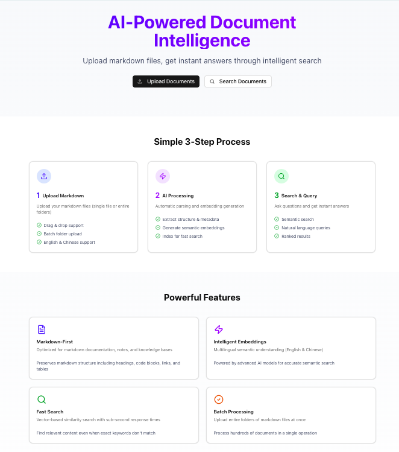
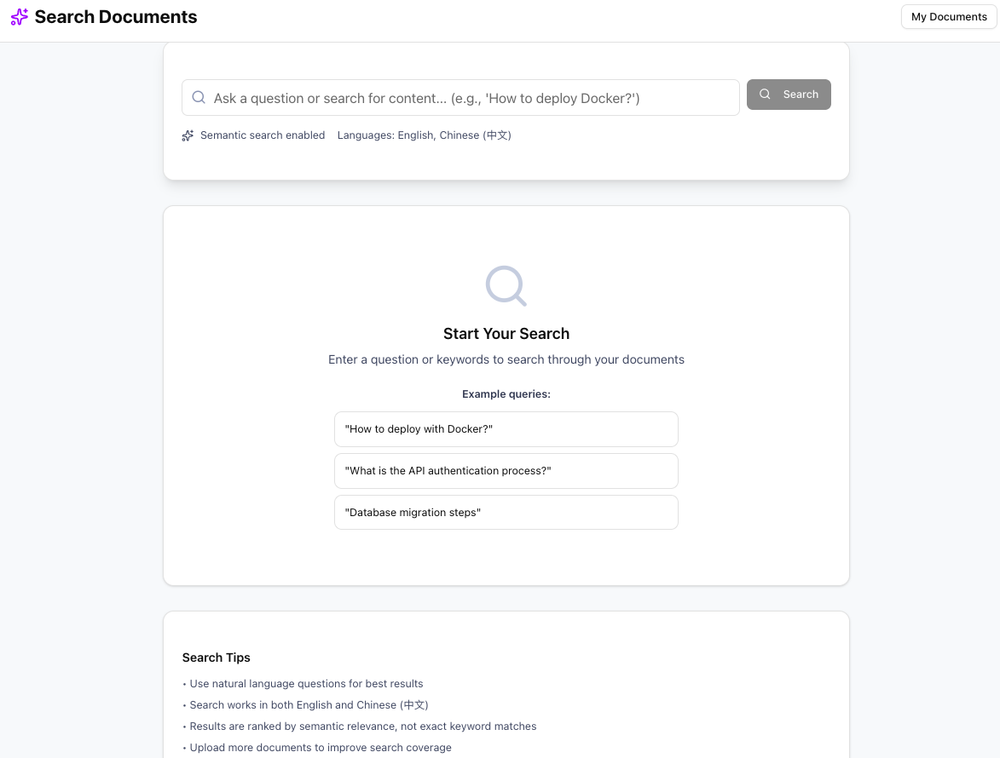
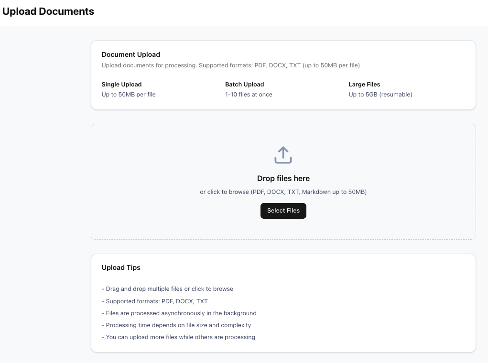



# AgenticOmni: AI-Powered Document Intelligence Platform

**Status**: ✅ MVP Complete - Document Upload & Processing Pipeline  
**Version**: 0.2.0  
**License**: Proprietary

---

## 🚀 Quick Links

<div style="display: grid; grid-template-columns: repeat(auto-fit, minmax(250px, 1fr)); gap: 20px; margin: 30px 0;">
  <div style="border: 1px solid #ddd; padding: 20px; border-radius: 8px;">
    <h3>📖 Quick Start</h3>
    <p>Get up and running in minutes</p>
    <a href="docs/QUICKSTART.html">Get Started →</a>
  </div>
  
  <div style="border: 1px solid #ddd; padding: 20px; border-radius: 8px;">
    <h3>📚 Documentation</h3>
    <p>Complete technical documentation</p>
    <a href="docs/README.html">Browse Docs →</a>
  </div>
  
  <div style="border: 1px solid #ddd; padding: 20px; border-radius: 8px;">
    <h3>⚙️ Configuration</h3>
    <p>Environment setup and configuration</p>
    <a href="docs/environment.html">Setup Guide →</a>
  </div>
  
  <div style="border: 1px solid #ddd; padding: 20px; border-radius: 8px;">
    <h3>🐙 GitHub</h3>
    <p>View source code and contribute</p>
    <a href="https://github.com/williamjxj/AgenticOmni">GitHub Repo →</a>
  </div>
</div>

---

## 📄 Overview

AgenticOmni is an enterprise-grade AI document intelligence platform built on an ETL-to-RAG pipeline architecture. The system transforms complex multi-format documents (PDF, DOCX, TXT) into searchable, intelligent knowledge bases powered by retrieval-augmented generation.

### 🎯 Key Features

#### Document Upload & Processing
- ✅ **Multi-Format Support**: PDF (Docling), DOCX (python-docx), TXT
- ✅ **Single & Batch Upload**: Upload 1-10 documents at once
- ✅ **Smart Validation**: File type detection (magic bytes), size limits, quota management
- ✅ **Async Processing**: Background parsing with Dramatiq task queue
- ✅ **Progress Tracking**: Real-time status updates (0-100% progress)
- ✅ **RAG-Optimized Chunking**: 512-token chunks with 50-token overlap
- ✅ **Storage Options**: Local filesystem or S3-compatible object storage
- ✅ **Security**: Malware scanning (ClamAV), content hashing for duplicates

#### API Endpoints
- `POST /api/v1/documents/upload` - Single document upload
- `POST /api/v1/documents/batch-upload` - Batch upload (up to 10 files)
- `GET /api/v1/documents/{id}` - Get document details
- `GET /api/v1/documents` - List documents with pagination
- `GET /api/v1/processing/jobs/{id}` - Get processing job status
- `POST /api/v1/processing/jobs/{id}/retry` - Retry failed job
- `POST /api/v1/processing/jobs/{id}/cancel` - Cancel processing job
- `GET /api/v1/health` - Health check

---

## 🏗️ Architecture

### Tech Stack

**Backend**
- FastAPI (async web framework)
- PostgreSQL 15 + pgvector (database & vector search)
- Dramatiq + Redis (task queue)
- Docling (PDF parsing)
- python-docx (DOCX parsing)
- ClamAV (malware scanning)

**Frontend**
- Next.js 14 (React framework)
- TypeScript
- Tailwind CSS
- shadcn/ui components

**Infrastructure**
- Docker & Docker Compose
- S3-compatible object storage
- Prometheus metrics
- Structured logging

---

## 📸 Screenshots

### Upload Interface

*Drag-and-drop upload with batch support*

### Document Management

*List and manage ingested documents*

### Search Interface

*AI-powered semantic search*

---

## 📖 Documentation

### Getting Started
- [Quick Start Guide](docs/QUICKSTART.html) - Get started in 5 minutes
- [Environment Setup](docs/environment.html) - Configuration reference
- [Frontend Guide](docs/frontend.html) - Frontend development

### Implementation
- [Implementation Status](docs/implementation.html) - Complete feature status
- [Changelog](docs/CHANGELOG.html) - Version history
- [Server Status](docs/servers-status.html) - Current service status

### Features
- [Malware Scanning](docs/malware-scanning.html) - ClamAV integration
- [Production Deployment](docs/production.html) - Production checklist
- [Next Steps](docs/next-steps.html) - Roadmap and future features

### Development
- [Contributing Guide](docs/CONTRIBUTING.html) - How to contribute
- [Versioning](docs/versioning.html) - Version control guide

---

## 🚀 Quick Start

### Prerequisites
- Python 3.11+
- PostgreSQL 15+
- Redis
- Node.js 18+
- Docker (optional)

### Installation

1. **Clone the repository**
   ```bash
   git clone https://github.com/williamjxj/AgenticOmni.git
   cd AgenticOmni
   ```

2. **Set up environment**
   ```bash
   cp .env.example .env
   # Edit .env with your configuration
   ```

3. **Start with Docker**
   ```bash
   docker-compose up -d
   ```

4. **Or install locally**
   ```bash
   # Backend
   pip install -r requirements.txt
   python -m src.main
   
   # Frontend
   cd frontend
   npm install
   npm run dev
   ```

5. **Access the application**
   - Frontend: http://localhost:3000
   - Backend API: http://localhost:8000
   - API Docs: http://localhost:8000/docs

For detailed instructions, see the [Quick Start Guide](docs/QUICKSTART.html).

---

## 📝 License

Proprietary - All Rights Reserved

---

## 🤝 Contributing

We welcome contributions! Please see our [Contributing Guide](docs/CONTRIBUTING) for details.

---

## 📞 Support

For questions and issues:
- Open an [issue](https://github.com/williamjxj/AgenticOmni/issues) on GitHub
- Check our [documentation](docs/README.html)

---

<p align="center">
  <strong>Built with ❤️ by the AgenticOmni Team</strong>
</p>
