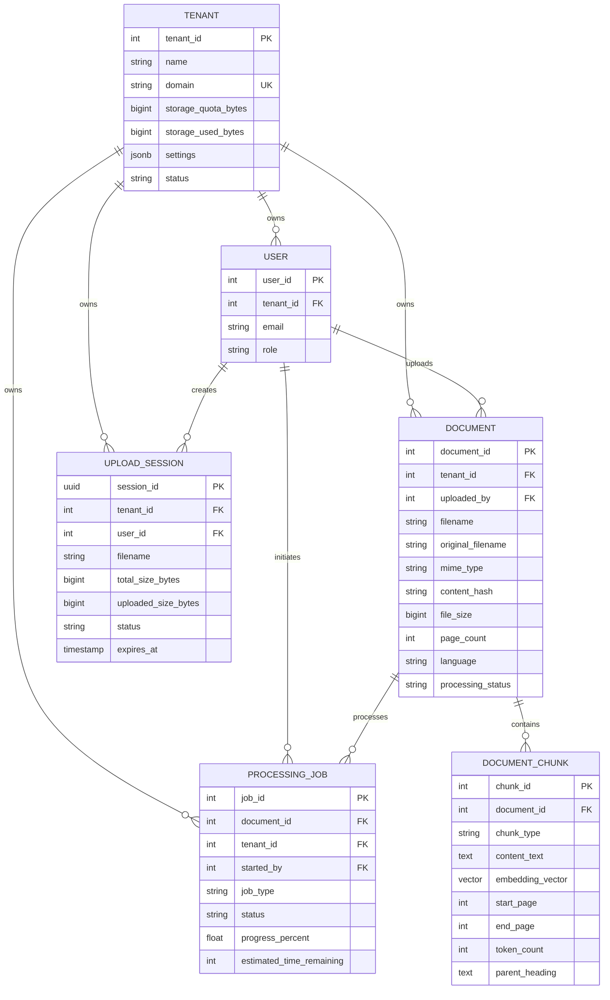

# Data Model: Document Upload and Parsing

**Feature**: 002-doc-upload-parsing  
**Date**: 2026-01-09  
**Base Schema**: [../001-app-skeleton-init/data-model.md](../001-app-skeleton-init/data-model.md)

---

## Overview

This document extends the existing AgenticOmni database schema to support document upload, parsing, chunking, and processing workflows. The model preserves backward compatibility while adding fields and entities required for multi-format document ingestion.

### Schema Changes Summary

- **4 Entity Updates**: Document, DocumentChunk, ProcessingJob, Tenant (add fields)
- **1 New Entity**: UploadSession (resumable uploads)
- **5 New Indexes**: Performance optimization for queries
- **2 New Enums**: ChunkType, UploadStatus

---

## Entity Definitions

### 1. Document (Updated)

**Purpose**: Represents an uploaded document with metadata and processing status

**Table**: `documents`

#### New Fields

| Field Name | Type | Nullable | Default | Description |
|------------|------|----------|---------|-------------|
| `content_hash` | VARCHAR(64) | NO | - | SHA-256 hash for duplicate detection |
| `language` | VARCHAR(10) | YES | NULL | Detected language (ISO 639-1, e.g., 'en') |
| `page_count` | INTEGER | YES | NULL | Number of pages (PDF/DOCX) |
| `uploaded_by` | INTEGER | NO | - | FK to users.user_id |
| `original_filename` | VARCHAR(255) | NO | - | Original filename from upload |
| `mime_type` | VARCHAR(100) | NO | - | Detected MIME type |

#### Existing Fields (from base schema)

| Field Name | Type | Nullable | Default | Description |
|------------|------|----------|---------|-------------|
| `document_id` | INTEGER | NO | AUTO | Primary key |
| `tenant_id` | INTEGER | NO | - | FK to tenants.tenant_id |
| `filename` | VARCHAR(255) | NO | - | Stored filename (system-generated) |
| `file_type` | VARCHAR(50) | NO | - | File extension (pdf, docx, txt) |
| `file_size` | BIGINT | NO | - | Size in bytes |
| `storage_path` | VARCHAR(500) | NO | - | Path or S3 key |
| `processing_status` | VARCHAR(50) | NO | 'uploaded' | Enum: uploaded, parsing, parsed, failed |
| `metadata` | JSONB | YES | {} | Additional metadata (user-provided) |
| `created_at` | TIMESTAMP | NO | NOW() | Upload timestamp |
| `updated_at` | TIMESTAMP | NO | NOW() | Last modified timestamp |

#### Constraints

- **Primary Key**: `document_id`
- **Foreign Keys**:
  - `tenant_id` → `tenants.tenant_id` (ON DELETE CASCADE)
  - `uploaded_by` → `users.user_id` (ON DELETE SET NULL)
- **Unique Constraint**: `(tenant_id, content_hash)` (prevent duplicate uploads)
- **Check Constraints**:
  - `file_size > 0`
  - `file_size <= 52428800` (50MB in bytes)
  - `page_count >= 0` (if not NULL)

#### Indexes

- `idx_documents_tenant_id` (existing): Query by tenant
- `idx_documents_status` (existing): Filter by processing status
- **NEW** `idx_documents_content_hash`: Duplicate detection
- **NEW** `idx_documents_uploaded_by`: Query by uploader
- **NEW** `idx_documents_created_at`: Time-based queries

#### Validation Rules

1. **File Size**: Must be between 1 byte and 50MB
2. **Content Hash**: Must be unique per tenant (allow same file in different tenants)
3. **MIME Type**: Must be in allowed list (application/pdf, application/vnd.openxmlformats-officedocument.wordprocessingml.document, text/plain)
4. **Language**: If provided, must be valid ISO 639-1 code (2 characters)
5. **Filename**: Must not contain path traversal characters (../, etc.)
6. **Uploaded By**: Must reference existing active user

#### Example Data

```json
{
  "document_id": 101,
  "tenant_id": 1,
  "uploaded_by": 5,
  "filename": "doc_20260109_abc123.pdf",
  "original_filename": "Q4 Financial Report.pdf",
  "file_type": "pdf",
  "file_size": 2457600,
  "mime_type": "application/pdf",
  "content_hash": "a3b5c7d9e1f2g3h4i5j6k7l8m9n0o1p2q3r4s5t6u7v8w9x0y1z2a3b4c5d6e7f8",
  "language": "en",
  "page_count": 24,
  "storage_path": "/1/101/doc_20260109_abc123.pdf",
  "processing_status": "parsed",
  "metadata": {
    "title": "Q4 Financial Report",
    "author": "Finance Team",
    "tags": ["finance", "quarterly", "2025"]
  },
  "created_at": "2026-01-09T10:30:00Z",
  "updated_at": "2026-01-09T10:32:15Z"
}
```

---

### 2. DocumentChunk (Updated)

**Purpose**: Represents a parsed segment of a document for vector search

**Table**: `document_chunks`

#### New Fields

| Field Name | Type | Nullable | Default | Description |
|------------|------|----------|---------|-------------|
| `chunk_type` | VARCHAR(50) | NO | 'text' | Enum: text, table, list, heading, code |
| `start_page` | INTEGER | YES | NULL | Starting page number (1-indexed) |
| `end_page` | INTEGER | YES | NULL | Ending page number |
| `token_count` | INTEGER | YES | NULL | Approximate tokens for LLM context |
| `parent_heading` | TEXT | YES | NULL | Section heading for context |

#### Existing Fields (from base schema)

| Field Name | Type | Nullable | Default | Description |
|------------|------|----------|---------|-------------|
| `chunk_id` | INTEGER | NO | AUTO | Primary key |
| `document_id` | INTEGER | NO | - | FK to documents.document_id |
| `content_text` | TEXT | NO | - | Extracted text content |
| `embedding_vector` | VECTOR(1536) | YES | NULL | pgvector embedding |
| `chunk_order` | INTEGER | NO | - | Sequence number (0-indexed) |
| `metadata` | JSONB | YES | {} | Additional metadata |
| `created_at` | TIMESTAMP | NO | NOW() | Chunk creation timestamp |

#### Constraints

- **Primary Key**: `chunk_id`
- **Foreign Keys**:
  - `document_id` → `documents.document_id` (ON DELETE CASCADE)
- **Unique Constraint**: `(document_id, chunk_order)` (sequential chunks)
- **Check Constraints**:
  - `chunk_order >= 0`
  - `token_count >= 0` (if not NULL)
  - `start_page <= end_page` (if both not NULL)
  - `LENGTH(content_text) > 0`

#### Indexes

- `idx_chunks_document_id` (existing): Query by document
- `idx_chunks_embedding_vector` (existing): Vector similarity search (HNSW or IVFFlat)
- **NEW** `idx_chunks_chunk_type`: Filter by type
- **NEW** `idx_chunks_pages`: Page range queries

#### Enum: ChunkType

```python
class ChunkType(str, Enum):
    TEXT = "text"           # Regular paragraph text
    TABLE = "table"         # Tabular data
    LIST = "list"           # Bulleted or numbered list
    HEADING = "heading"     # Section heading
    CODE = "code"           # Code block (future)
```

#### Validation Rules

1. **Content Text**: Must not be empty, max 10,000 characters
2. **Token Count**: If provided, must be between 1 and 2000 tokens
3. **Page Range**: start_page ≤ end_page, both must be positive integers
4. **Chunk Order**: Must be sequential (0, 1, 2, ...) within a document
5. **Chunk Type**: Must be valid enum value

#### Example Data

```json
{
  "chunk_id": 5001,
  "document_id": 101,
  "chunk_order": 0,
  "chunk_type": "heading",
  "content_text": "Executive Summary",
  "parent_heading": null,
  "start_page": 1,
  "end_page": 1,
  "token_count": 3,
  "embedding_vector": [0.023, -0.145, 0.678, ...],  // 1536 dimensions
  "metadata": {
    "heading_level": 1,
    "font_size": 18
  },
  "created_at": "2026-01-09T10:32:10Z"
}
```

---

### 3. ProcessingJob (Updated)

**Purpose**: Tracks asynchronous document processing tasks

**Table**: `processing_jobs`

#### New Fields

| Field Name | Type | Nullable | Default | Description |
|------------|------|----------|---------|-------------|
| `progress_percent` | FLOAT | YES | 0.0 | Current progress (0-100) |
| `estimated_time_remaining` | INTEGER | YES | NULL | ETA in seconds |
| `started_by` | INTEGER | YES | NULL | FK to users.user_id (who triggered) |

#### Existing Fields (from base schema)

| Field Name | Type | Nullable | Default | Description |
|------------|------|----------|---------|-------------|
| `job_id` | INTEGER | NO | AUTO | Primary key |
| `document_id` | INTEGER | YES | NULL | FK to documents.document_id |
| `tenant_id` | INTEGER | NO | - | FK to tenants.tenant_id |
| `job_type` | VARCHAR(50) | NO | - | Enum: parse_document, generate_embeddings |
| `status` | VARCHAR(50) | NO | 'pending' | Enum: pending, processing, completed, failed, retrying, cancelled |
| `retry_count` | INTEGER | NO | 0 | Number of retry attempts |
| `max_retries` | INTEGER | NO | 3 | Maximum allowed retries |
| `started_at` | TIMESTAMP | YES | NULL | Job start time |
| `completed_at` | TIMESTAMP | YES | NULL | Job completion time |
| `error_message` | TEXT | YES | NULL | Error details if failed |
| `created_at` | TIMESTAMP | NO | NOW() | Job creation timestamp |

#### Constraints

- **Primary Key**: `job_id`
- **Foreign Keys**:
  - `document_id` → `documents.document_id` (ON DELETE CASCADE)
  - `tenant_id` → `tenants.tenant_id` (ON DELETE CASCADE)
  - `started_by` → `users.user_id` (ON DELETE SET NULL)
- **Check Constraints**:
  - `progress_percent >= 0 AND progress_percent <= 100`
  - `estimated_time_remaining >= 0` (if not NULL)
  - `retry_count >= 0`
  - `max_retries >= 0`
  - `retry_count <= max_retries`

#### Indexes

- `idx_jobs_tenant_id` (existing): Query by tenant
- `idx_jobs_status` (existing): Filter by status
- `idx_jobs_document_id` (existing): Query by document
- **NEW** `idx_jobs_created_at`: Time-based queries

#### State Machine

```
pending → processing → completed
                    ↓
                  failed ← retrying
                    ↓
                cancelled
```

#### Validation Rules

1. **Progress Percent**: Must be between 0 and 100
2. **Status Transitions**: Only valid state transitions allowed (enforced in application)
3. **Retry Logic**: retry_count must not exceed max_retries
4. **Timestamps**: started_at must be before completed_at
5. **Error Message**: Required if status is 'failed'

#### Example Data

```json
{
  "job_id": 2001,
  "document_id": 101,
  "tenant_id": 1,
  "started_by": 5,
  "job_type": "parse_document",
  "status": "processing",
  "progress_percent": 65.5,
  "estimated_time_remaining": 45,
  "retry_count": 0,
  "max_retries": 3,
  "started_at": "2026-01-09T10:30:30Z",
  "completed_at": null,
  "error_message": null,
  "created_at": "2026-01-09T10:30:25Z"
}
```

---

### 4. Tenant (Updated)

**Purpose**: Multi-tenant organization with storage quota enforcement

**Table**: `tenants`

#### New Fields

| Field Name | Type | Nullable | Default | Description |
|------------|------|----------|---------|-------------|
| `storage_quota_bytes` | BIGINT | NO | 10737418240 | Maximum storage (10GB default) |
| `storage_used_bytes` | BIGINT | NO | 0 | Current storage usage |

#### Existing Fields (from base schema)

| Field Name | Type | Nullable | Default | Description |
|------------|------|----------|---------|-------------|
| `tenant_id` | INTEGER | NO | AUTO | Primary key |
| `name` | VARCHAR(255) | NO | - | Tenant organization name |
| `domain` | VARCHAR(255) | NO | - | Unique domain identifier |
| `settings` | JSONB | YES | {} | Tenant-specific configuration |
| `status` | VARCHAR(50) | NO | 'active' | Enum: active, suspended, deleted |
| `created_at` | TIMESTAMP | NO | NOW() | Tenant creation timestamp |
| `updated_at` | TIMESTAMP | NO | NOW() | Last modified timestamp |

#### Constraints

- **Primary Key**: `tenant_id`
- **Unique Constraint**: `domain` (globally unique)
- **Check Constraints**:
  - `storage_quota_bytes > 0`
  - `storage_used_bytes >= 0`
  - `storage_used_bytes <= storage_quota_bytes` (enforced before insert/update)

#### Indexes

- `idx_tenants_domain` (existing): Unique lookup by domain
- `idx_tenants_status` (existing): Filter active tenants

#### Validation Rules

1. **Storage Quota**: Must be at least 1GB (1073741824 bytes)
2. **Storage Used**: Cannot exceed quota (enforced in upload service)
3. **Quota Updates**: Must ensure used_bytes ≤ new quota when updating
4. **Status**: 'suspended' status prevents new uploads

#### Example Data

```json
{
  "tenant_id": 1,
  "name": "Acme Corporation",
  "domain": "acme-corp",
  "storage_quota_bytes": 107374182400,  // 100GB
  "storage_used_bytes": 25769803776,    // 24GB used
  "status": "active",
  "settings": {
    "allowed_file_types": ["pdf", "docx", "txt"],
    "max_file_size_mb": 50,
    "enable_malware_scanning": true
  },
  "created_at": "2026-01-01T00:00:00Z",
  "updated_at": "2026-01-09T10:00:00Z"
}
```

---

### 5. UploadSession (New Entity)

**Purpose**: Track resumable upload progress for large files

**Table**: `upload_sessions`

#### Fields

| Field Name | Type | Nullable | Default | Description |
|------------|------|----------|---------|-------------|
| `session_id` | UUID | NO | - | Primary key |
| `tenant_id` | INTEGER | NO | - | FK to tenants.tenant_id |
| `user_id` | INTEGER | NO | - | FK to users.user_id |
| `filename` | VARCHAR(255) | NO | - | Original filename |
| `mime_type` | VARCHAR(100) | NO | - | Detected MIME type |
| `total_size_bytes` | BIGINT | NO | - | Total file size |
| `uploaded_size_bytes` | BIGINT | NO | 0 | Bytes uploaded so far |
| `chunk_size_bytes` | INTEGER | NO | 5242880 | Chunk size (5MB default) |
| `storage_path` | VARCHAR(500) | NO | - | Temporary storage location |
| `status` | VARCHAR(50) | NO | 'active' | Enum: active, completed, cancelled, expired |
| `expires_at` | TIMESTAMP | NO | - | Session expiration (24 hours) |
| `created_at` | TIMESTAMP | NO | NOW() | Session creation timestamp |
| `updated_at` | TIMESTAMP | NO | NOW() | Last chunk upload timestamp |

#### Constraints

- **Primary Key**: `session_id`
- **Foreign Keys**:
  - `tenant_id` → `tenants.tenant_id` (ON DELETE CASCADE)
  - `user_id` → `users.user_id` (ON DELETE CASCADE)
- **Check Constraints**:
  - `total_size_bytes > 0`
  - `uploaded_size_bytes >= 0`
  - `uploaded_size_bytes <= total_size_bytes`
  - `chunk_size_bytes > 0`
  - `expires_at > created_at`

#### Indexes

- `idx_upload_sessions_tenant_user`: Query by tenant and user
- `idx_upload_sessions_status`: Filter by status
- `idx_upload_sessions_expires_at`: Cleanup expired sessions

#### Enum: UploadStatus

```python
class UploadStatus(str, Enum):
    ACTIVE = "active"           # Upload in progress
    COMPLETED = "completed"     # All chunks uploaded, merged
    CANCELLED = "cancelled"     # User cancelled
    EXPIRED = "expired"         # Session expired (24 hours)
```

#### Validation Rules

1. **Total Size**: Must be between 1MB and 50MB
2. **Chunk Size**: Typically 5MB (configurable)
3. **Expiration**: Set to 24 hours from created_at
4. **Uploaded Size**: Must not exceed total_size_bytes
5. **Filename**: Must not contain path traversal characters

#### Lifecycle

1. **Create**: POST /upload/resumable creates session
2. **Update**: PATCH /upload/resumable/{session_id} uploads chunks
3. **Complete**: When uploaded_size_bytes == total_size_bytes, merge chunks → create Document
4. **Cleanup**: Periodic job deletes expired sessions (status = 'expired')

#### Example Data

```json
{
  "session_id": "f47ac10b-58cc-4372-a567-0e02b2c3d479",
  "tenant_id": 1,
  "user_id": 5,
  "filename": "Large Report.pdf",
  "mime_type": "application/pdf",
  "total_size_bytes": 45000000,
  "uploaded_size_bytes": 25000000,
  "chunk_size_bytes": 5242880,
  "storage_path": "/tmp/uploads/f47ac10b-58cc-4372-a567-0e02b2c3d479",
  "status": "active",
  "expires_at": "2026-01-10T10:30:00Z",
  "created_at": "2026-01-09T10:30:00Z",
  "updated_at": "2026-01-09T10:35:00Z"
}
```

---

## Relationships

### Entity Relationship Diagram



---

## Migrations

### Migration: `002_add_upload_parsing_fields.py`

**Description**: Add document upload and parsing fields to existing schema

**Up Migration**:

```sql
-- Add fields to documents table
ALTER TABLE documents ADD COLUMN content_hash VARCHAR(64) NOT NULL;
ALTER TABLE documents ADD COLUMN language VARCHAR(10);
ALTER TABLE documents ADD COLUMN page_count INTEGER;
ALTER TABLE documents ADD COLUMN uploaded_by INTEGER;
ALTER TABLE documents ADD COLUMN original_filename VARCHAR(255) NOT NULL;
ALTER TABLE documents ADD COLUMN mime_type VARCHAR(100) NOT NULL;

-- Add foreign key for uploaded_by
ALTER TABLE documents ADD CONSTRAINT fk_documents_uploaded_by 
  FOREIGN KEY (uploaded_by) REFERENCES users(user_id) ON DELETE SET NULL;

-- Add unique constraint for duplicate detection
ALTER TABLE documents ADD CONSTRAINT uq_documents_tenant_hash 
  UNIQUE (tenant_id, content_hash);

-- Add indexes
CREATE INDEX idx_documents_content_hash ON documents(content_hash);
CREATE INDEX idx_documents_uploaded_by ON documents(uploaded_by);
CREATE INDEX idx_documents_created_at ON documents(created_at);

-- Add fields to document_chunks table
ALTER TABLE document_chunks ADD COLUMN chunk_type VARCHAR(50) NOT NULL DEFAULT 'text';
ALTER TABLE document_chunks ADD COLUMN start_page INTEGER;
ALTER TABLE document_chunks ADD COLUMN end_page INTEGER;
ALTER TABLE document_chunks ADD COLUMN token_count INTEGER;
ALTER TABLE document_chunks ADD COLUMN parent_heading TEXT;

-- Add indexes to document_chunks
CREATE INDEX idx_chunks_chunk_type ON document_chunks(chunk_type);
CREATE INDEX idx_chunks_pages ON document_chunks(start_page, end_page);

-- Add fields to processing_jobs table
ALTER TABLE processing_jobs ADD COLUMN progress_percent FLOAT DEFAULT 0.0;
ALTER TABLE processing_jobs ADD COLUMN estimated_time_remaining INTEGER;
ALTER TABLE processing_jobs ADD COLUMN started_by INTEGER;

-- Add foreign key for started_by
ALTER TABLE processing_jobs ADD CONSTRAINT fk_jobs_started_by 
  FOREIGN KEY (started_by) REFERENCES users(user_id) ON DELETE SET NULL;

-- Add index to processing_jobs
CREATE INDEX idx_jobs_created_at ON processing_jobs(created_at);

-- Add fields to tenants table
ALTER TABLE tenants ADD COLUMN storage_quota_bytes BIGINT NOT NULL DEFAULT 10737418240;  -- 10GB
ALTER TABLE tenants ADD COLUMN storage_used_bytes BIGINT NOT NULL DEFAULT 0;

-- Add check constraint for storage quota
ALTER TABLE tenants ADD CONSTRAINT chk_tenants_storage_quota 
  CHECK (storage_used_bytes >= 0 AND storage_used_bytes <= storage_quota_bytes);

-- Create upload_sessions table
CREATE TABLE upload_sessions (
    session_id UUID PRIMARY KEY DEFAULT gen_random_uuid(),
    tenant_id INTEGER NOT NULL REFERENCES tenants(tenant_id) ON DELETE CASCADE,
    user_id INTEGER NOT NULL REFERENCES users(user_id) ON DELETE CASCADE,
    filename VARCHAR(255) NOT NULL,
    mime_type VARCHAR(100) NOT NULL,
    total_size_bytes BIGINT NOT NULL,
    uploaded_size_bytes BIGINT NOT NULL DEFAULT 0,
    chunk_size_bytes INTEGER NOT NULL DEFAULT 5242880,  -- 5MB
    storage_path VARCHAR(500) NOT NULL,
    status VARCHAR(50) NOT NULL DEFAULT 'active',
    expires_at TIMESTAMP NOT NULL,
    created_at TIMESTAMP NOT NULL DEFAULT CURRENT_TIMESTAMP,
    updated_at TIMESTAMP NOT NULL DEFAULT CURRENT_TIMESTAMP,
    CONSTRAINT chk_upload_sessions_size CHECK (uploaded_size_bytes >= 0 AND uploaded_size_bytes <= total_size_bytes),
    CONSTRAINT chk_upload_sessions_expiry CHECK (expires_at > created_at)
);

-- Create indexes on upload_sessions
CREATE INDEX idx_upload_sessions_tenant_user ON upload_sessions(tenant_id, user_id);
CREATE INDEX idx_upload_sessions_status ON upload_sessions(status);
CREATE INDEX idx_upload_sessions_expires_at ON upload_sessions(expires_at);
```

**Down Migration**:

```sql
-- Drop upload_sessions table
DROP TABLE IF EXISTS upload_sessions;

-- Remove fields from tenants
ALTER TABLE tenants DROP COLUMN IF EXISTS storage_quota_bytes;
ALTER TABLE tenants DROP COLUMN IF EXISTS storage_used_bytes;

-- Remove fields from processing_jobs
ALTER TABLE processing_jobs DROP CONSTRAINT IF EXISTS fk_jobs_started_by;
DROP INDEX IF EXISTS idx_jobs_created_at;
ALTER TABLE processing_jobs DROP COLUMN IF EXISTS progress_percent;
ALTER TABLE processing_jobs DROP COLUMN IF EXISTS estimated_time_remaining;
ALTER TABLE processing_jobs DROP COLUMN IF EXISTS started_by;

-- Remove fields from document_chunks
DROP INDEX IF EXISTS idx_chunks_chunk_type;
DROP INDEX IF EXISTS idx_chunks_pages;
ALTER TABLE document_chunks DROP COLUMN IF EXISTS chunk_type;
ALTER TABLE document_chunks DROP COLUMN IF EXISTS start_page;
ALTER TABLE document_chunks DROP COLUMN IF EXISTS end_page;
ALTER TABLE document_chunks DROP COLUMN IF EXISTS token_count;
ALTER TABLE document_chunks DROP COLUMN IF EXISTS parent_heading;

-- Remove fields from documents
ALTER TABLE documents DROP CONSTRAINT IF EXISTS fk_documents_uploaded_by;
ALTER TABLE documents DROP CONSTRAINT IF EXISTS uq_documents_tenant_hash;
DROP INDEX IF EXISTS idx_documents_content_hash;
DROP INDEX IF EXISTS idx_documents_uploaded_by;
DROP INDEX IF EXISTS idx_documents_created_at;
ALTER TABLE documents DROP COLUMN IF EXISTS content_hash;
ALTER TABLE documents DROP COLUMN IF EXISTS language;
ALTER TABLE documents DROP COLUMN IF EXISTS page_count;
ALTER TABLE documents DROP COLUMN IF EXISTS uploaded_by;
ALTER TABLE documents DROP COLUMN IF EXISTS original_filename;
ALTER TABLE documents DROP COLUMN IF EXISTS mime_type;
```

---

## Testing Strategy

### Unit Tests

1. **Model Validation**: Test constraints (file size, quota, page range)
2. **Unique Constraints**: Test duplicate content_hash detection
3. **Foreign Key Cascades**: Verify deletion behavior
4. **State Transitions**: Test ProcessingJob state machine
5. **Quota Enforcement**: Test storage quota checks

### Integration Tests

1. **Document Upload Flow**: Create document → verify in DB
2. **Chunking Flow**: Parse document → create chunks → verify chunk_order
3. **Job Tracking**: Create job → update progress → mark complete
4. **Resumable Upload**: Create session → upload chunks → merge
5. **Quota Exceeded**: Attempt upload when quota full → expect error
6. **Duplicate Detection**: Upload same file twice → expect error

### Test Data

Create test fixtures in `tests/fixtures/sample_data.py`:
- Sample Document records with various file types
- Sample DocumentChunk records with different chunk types
- Sample ProcessingJob records in various statuses
- Sample UploadSession records at different progress levels

---

## Performance Considerations

### Query Optimization

1. **Document Listing**: Use `idx_documents_tenant_id` + pagination
2. **Status Filtering**: Use `idx_documents_status` for dashboard queries
3. **Duplicate Detection**: Use `idx_documents_content_hash` for hash lookups
4. **Vector Search**: Use HNSW index on `embedding_vector` (pgvector)
5. **Job Polling**: Use `idx_jobs_created_at` for recent jobs

### Index Maintenance

- **VACUUM**: Run regularly on documents and chunks tables
- **ANALYZE**: Update statistics after bulk imports
- **Index Rebuilding**: Monitor index bloat, rebuild if >50% bloat

### Storage Quota Updates

Update `storage_used_bytes` efficiently:
```sql
UPDATE tenants 
SET storage_used_bytes = storage_used_bytes + :file_size 
WHERE tenant_id = :tenant_id 
AND storage_used_bytes + :file_size <= storage_quota_bytes
RETURNING storage_used_bytes;
```

---

## References

- Base Schema: [../001-app-skeleton-init/data-model.md](../001-app-skeleton-init/data-model.md)
- Feature Spec: [spec.md](./spec.md)
- Research: [research.md](./research.md)
- PostgreSQL CHECK Constraints: https://www.postgresql.org/docs/current/ddl-constraints.html
- pgvector Indexes: https://github.com/pgvector/pgvector#indexing
