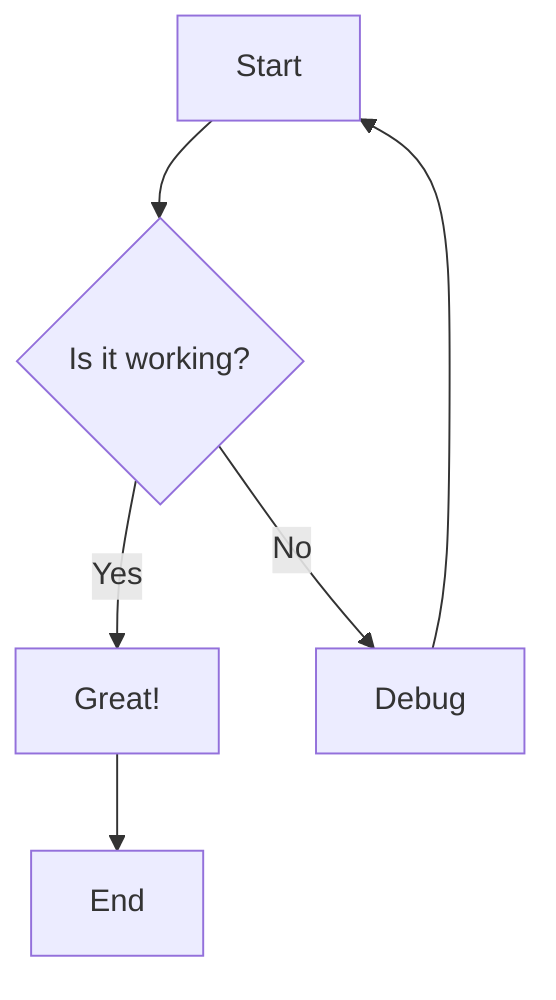
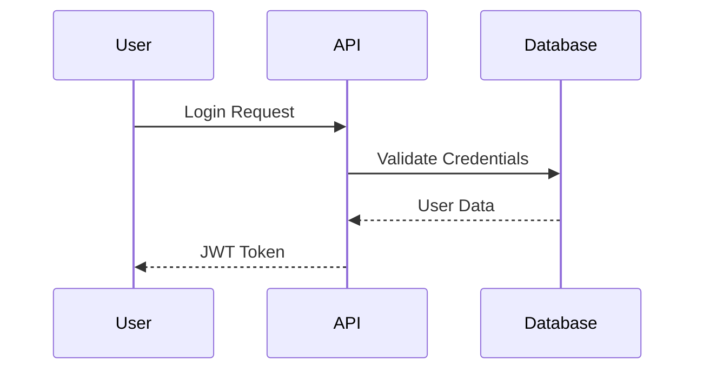
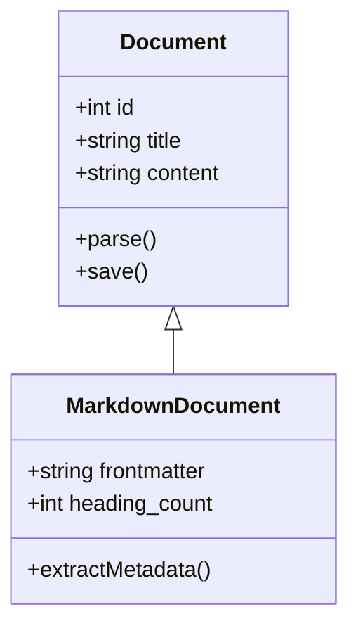

# Document with Mermaid Diagrams

This document contains Mermaid diagrams for testing diagram detection and extraction.

## Flow Diagram



## Sequence Diagram

Here's a sequence diagram showing API authentication:



## Class Diagram



## Regular Code Block

Not all code blocks are Mermaid diagrams:

```python
def process_mermaid(diagram_code):
    """Extract Mermaid diagram metadata."""
    return {
        'type': 'mermaid',
        'code': diagram_code
    }
```

## Testing Requirements

This document tests:
1. Detection of Mermaid code blocks (3 diagrams)
2. Extraction of diagram types (graph, sequence, class)
3. Differentiation from regular code blocks
4. Storage of diagram code for future rendering
